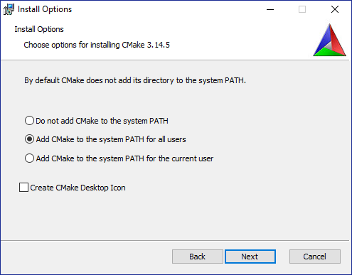
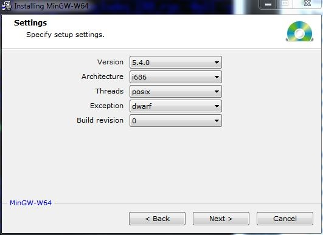

<!--
* KINOVA (R) KORTEX (TM)
*
* Copyright (c) 2018 Kinova inc. All rights reserved.
*
* This software may be modified and distributed
* under the terms of the BSD 3-Clause license.
*
* Refer to the LICENSE file for details.
*
-->

<!-- TOC -->

<h1>C++ examples</h1>

<h2>Table of Contents</h2>

- [Setup (C++ environment)](#setup-c-environment)
  - [Set up PC environment](#set-up-pc-environment)
    - [CMake](#cmake)
    - [GCC compiler](#gcc-compiler)
      - [Procedure to install GCC under Linux (GCC 5.4 on Ubuntu 16.04, GCC 7.4 on Ubuntu 18.04)](#procedure-to-install-gcc-under-linux-gcc-54-on-ubuntu-1604-gcc-74-on-ubuntu-1804)
      - [Procedure to install GCC 5.4 under Windows](#procedure-to-install-gcc-54-under-windows)
  - [Conan](#conan)
    - [Using Conan](#using-conan)
    - [Not using Conan](#not-using-conan)
- [Build](#build)
- [Run](#run)
- [C++ API documentation](#c-api-documentation)
- [Reference](#reference)
      - [Useful Links](#useful-links)
  - [Back to root topic: **readme.md**](#back-to-root-topic-readmemd)

<!-- /TOC -->
<!--   - [Docker environment](#docker-environment)
      - [Refer to the main README for Docker installation details: **[parent readme]**](#refer-to-the-main-readme-for-docker-instalation-details-parent-readme) 
 -->
 
<a id="markdown-setup-example-cpp-environment" name="setup-example-cpp-environment"></a>
# Setup (C++ environment)

<!--
<a id="markdown-docker-environment" name="docker-environment"></a>
## Docker environment
> 
> Consider using Docker as a starting point
<a id="markdown-refer-to-the-main-readme-for-docker-instalation-details-parent-readme" name="refer-to-the-main-readme-for-docker-instalation-details-parent-readme"></a>
#### Refer to the main README for Docker installation details: **[parent readme]**

<p></p>
-->

<a id="markdown-setup-pc-environment" name="setup-pc-environment"></a>
## Set up PC environment

<a id="markdown-cmake" name="cmake"></a>
### CMake
The C++ example projects in this repository use CMake.  
The following link has the instructions to install CMake.  
 - cmake >= 3.5: [CMake install page](https://cmake.org/install)

On Windows, make sure you add CMake to your PATH variable

 
<a id="markdown-gcc-54-compiler-prefered" name="gcc-54-compiler-prefered"></a>
### GCC compiler  
 
 To check which version of GCC is installed on Windows or Linux  
**Note:** This procedure only works on Windows if you add the MinGW bin directory path to the PATH environment variable.

 ```sh
 gcc --version
 ```
<a id="markdown-procedure-to-install-gcc-54-under-linux-ubuntu-1604" name="procedure-to-install-gcc-54-under-linux-ubuntu-1604"></a>

#### Procedure to install GCC under Linux (GCC 5.4 on Ubuntu 16.04, GCC 7.4 on Ubuntu 18.04)
```sh
sudo apt-get install build-essential
```

<a id="markdown-procedure-to-install-gcc-54-under-windows" name="procedure-to-install-gcc-54-under-windows"></a>
#### Procedure to install GCC 5.4 under Windows
Because GCC is not coded for the Windows operating system, a GCC port of MinGW-w64 for Windows is required. The '-w64' suffix indicates that it can support a 32-bit or 64-bit environment. The 32-bit versions are still available and one of them will be used to compile the affected project.

1. Go to  https://sourceforge.net/projects/mingw-w64
2. Start the installer and click `Next` until you reach the installation options page
3. On the options page ensure that the options look exactly like this (all options are the default values, except for version, which is the version of GCC we want to install - 5.4 in this case)
 
 
 
4. Click `Next` until the end of the installation. The install directory by default is the one set in the build script included with the project.
5. Add the path of the bin directory to the system path to make all the MinGW commands and tools available system wide:
    - Right-click on the `Start` Button
    - Select `System` from the context menu.
    - Click `Advanced system settings`
    - Go to the `Advanced` tab
    - Click `Environment Variables…`
    - Click variable called `Path` and click `Edit…`
    - Click `New`
    - Enter the path to the folder containing the binary you want on your `PATH` (e.g. `C:\Program Files (x86)\mingw-w64\i686-5.4.0-posix-dwarf-rt_v5-rev0\mingw32\bin`)

<!-- omit in toc 
<a id="markdown-windows-msvc-2017-compiler-for-" name="windows-msvc-2017-compiler-for-"></a>
### Windows MSVC 2017 Compiler (for)  
> 
> + Install “Build tools for Visual Studio 2017” from here: [Microsoft VS 2017 Download](https://visualstudio.microsoft.com/downloads/?rr=https%3A%2F%2Fwww.google.ca%2F)
> + Launch the “x64 Native Tools Command Prompt for Visual Studio 2017”.  It should be found under the default installation folder:  
> <code>“C:\ProgramData\Microsoft\Windows\Start Menu\Programs\Visual Studio 2017\Visual Studio Tools\VC”</code>
> 
-->

<a id="markdown-conan" name="conan"></a>
## Conan

### Using Conan

The C++ examples use the Conan package manager for fetching its dependencies. 
This is done by default and requires Conan to be installed.

You can refer to the [Conan Installation Tutorial](https://docs.conan.io/en/latest/installation.html) for installing Conan.
**Note**: It is recommended to install Python3 for Conan. You can download and install Python3 from https://www.python.org/  

When installing `conan` via `pip` the new directory might not be appended to the PATH. This can be solved on Ubuntu by restarting the terminal or by using `source ~/.profile` or by adding the installed PATH (that you can find with `pip show conan`) to your PATH environnement variable in Windows.

Next, enable the revision feature for Artifactory plugin
```sh
conan config set general.revisions_enabled=1
```

Create an automatically detected default profile
```sh
conan profile new default --detect 
```

After Conan is properly installed, build as specified in the [build](#build) section.

### Not using Conan

Although building with Conan is recommended, it is possible to disable it.

Doing so requires calling cmake with an additional option: `-DUSE_CONAN=OFF`.

Example (Linux):

```sh
 mkdir build  
 cd build  
 cmake .. -DUSE_CONAN=OFF -DCMAKE_BUILD_TYPE=release [-DKORTEX_SUB_DIR=<kortex_api_sub_folder dir name>]
 make  
 ```

This applies to all the manual build commands. The build scripts can also be modified to add this option.

Example (build-mingw.bat)

```bat
(line 17) cmake .. -G "MinGW Makefiles" -DUSE_CONAN=OFF -DCMAKE_BUILD_TYPE=%build_type% -DKORTEX_SUB_DIR=%kortex_api_sub_folder% && mingw32-make
```

This will effectively revert to the old build method. It requires downloading the Kortex Api library:
 + Download the archive via Kinova's Artifactory server: [kortex_api](https://artifactory.kinovaapps.com/artifactory/generic-public/kortex/API/2.3.0/)
 + Uncompress the content of the archive and place it in the directory `kortex_api`.  

```sh
examples/kortex_api  
┬  
├ include/
├ lib/  
└   ┬  
    ├ debug/  
    └ release/
```

You can also uncompress the content of the archive in a sub-directory `kortex_api/<Something>`. You will then have to use the `KORTEX_SUB_DIR` CMake argument to specify the Kortex API sub-directory.

```sh
examples/kortex_api  
┬  
├ Something/ [e.g. linux_gcc_x86-64]
└   ┬  
    ├ include/
    ├ lib/  
└       ┬  
        ├ debug/  
        └ release/
```

<a id="markdown-build-instruction" name="build-instruction"></a>
# Build

**Note**: The C++ examples use the Conan package manager by default.
Refer to the [Conan](#conan) section on how to install Conan or revert to building without Conan.

To build, you need change the current directory to the example directory. 
The build instructions then depend on your OS and compiler (see below).

```sh
my_example_repo  
┬  
├ api_cpp/
└   ┬  
    ├ doc/
    └ examples/     (you have to cd here)
```

 <p><details open>
 <summary>Linux Ubuntu</summary>

 You can run the build script:
 ```
 ./scripts/build-gcc.sh {release|debug}
 ```

 You can also build manually:
 ```sh
 mkdir build  
 cd build  
 cmake .. -DCMAKE_BUILD_TYPE=release [-DKORTEX_SUB_DIR=<kortex_api_sub_folder dir name>]
 make  
 ```

 </details></p>  

 <p><details open>
 <p></p>
 
 **Note:** the name of the executable is `mingw32-make.exe`, even for the 64-bit version)

 <summary>Windows - using GCC</summary>
 

 You can run the build script:
 ```
 scripts\build-mingw.bat {release|debug}
 ```

 You can also build manually:
 ```bat
 mkdir build  
 cd build  
 cmake .. -G "MinGW Makefiles" -DCMAKE_BUILD_TYPE=release [-DKORTEX_SUB_DIR=<kortex_api_sub_folder dir name>]  
 mingw32-make  
 ```

 </details></p>  

<p><details open>
<summary>Windows - using Visual Studio 2017</summary>

 ```sh
 mkdir build  
 cd build  
 cmake .. -G "Visual Studio 15 2017 [arch]" -DCMAKE_SH=CMAKE_SH-NOTFOUND -DCMAKE_BUILD_TYPE=release [-DKORTEX_SUB_DIR=<kortex_api_sub_folder dir name>]  
 ```

 </details></p> 

<p><details open>
<summary>Windows - using command-line MSVC build</summary>

 Setup the build environment:
 
 **Note:** Make sure to adjust the path to match the location of your installed BuildTools call: 
 
 `C:\Program Files (x86)\Microsoft Visual Studio\2017\BuildTools\VC\Auxiliary\Build\vcvars64.bat`

 You can run the build script:
 ```
 scripts\build-msvc.bat {release|debug} {static|dynamic}
 ```

 You can also build manually:
 ```bat
 mkdir build  
 cmake .. -G "NMake Makefiles" -DCMAKE_BUILD_TYPE=Release [-DKORTEX_SUB_DIR=<kortex_api_sub_folder dir name>]
 nmake
 ```

 </details></p>  

<a id="markdown-how-to-use-examples-with-your-robot" name="how-to-use-examples-with-your-robot"></a>
# Run

We assume the robot is using its default IP address: `192.168.1.10`.

Before you start make sure you run the test in a safe area - some examples contain movement. Also verify that your robot is correctly afixed to your working surface.

Prerequisites:
+ The examples require a wired connection to your computer
+ Configure a static IP on your network interface (e.g: `192.168.1.11/24`)

Each example has its own `main` function so you can run them individually from the examples folder.

On Linux :
```sh
./<your_build_folder>/<example_name>
```

On Windows :
```bat
<your_build_folder>\<example_name>.exe
```

<a id="markdown-api-documentation" name="api-documentation"></a>
# C++ API documentation
Here is a link to the generated documentation:  
[API C++ Services Documentation](../doc/markdown/index.md)  

<a id="markdown-reference" name="reference"></a>
# Reference
<a id="markdown-usefull-links" name="usefull-links"></a>
#### Useful Links
|  |  |  
| ---: | --- |  
| Google Proto Buffer generated C++: | https://developers.google.com/protocol-buffers/docs/reference/cpp-generated |  

__________________________
<a id="markdown-back-to-root-topic-readmemdreadmemd" name="back-to-root-topic-readmemd"></a>
## Back to root topic: **[readme.md](../../readme.md)**  
